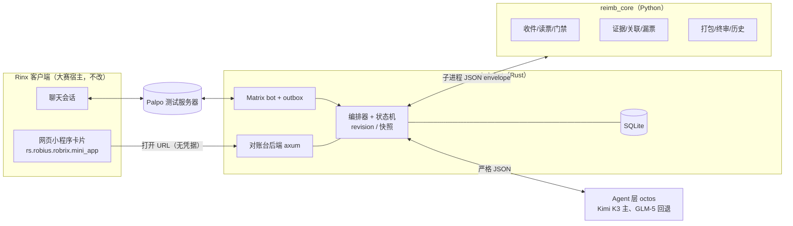

# 报销对账 Agent · 基础版设计

- 版本：**v1.0（冻结）**。v0.1 经二环交叉评审（R1–R14 全部采纳），外环裁定见 `hub/design-review-ruling.md`
- 日期：2026-09-27
- 任务：task `47d65f86` · BUNOTES-298 · 分支 `task/bunotes-298-base-version`
- 仓库：https://github.com/BUNotesAI/Invoice-Reconciliation （公开，Apache-2.0，引导提交 `78d65392c3ecdb3b1ab2860cdb8cc7ace5913589`）
- 作者：外环（本项目外环主导设计与验收）；交叉评审：二环 ring2-codex-owner-base
- 相关：预演报告（作者本机报告目录，不随仓库发布）

## 0. v0.1 → v1.0 变更摘要

| 评审 | 变更 | 位置 |
|---|---|---|
| R1 | 报销历史台账；重开票只在原票作废且未付款时替换入账 | §5.7、§10 |
| R2 | 事实三级：extracted / candidate / confirmed；视觉读数必须用户确认；报告计数改为 6/4/2 | §5.1、§5.2、§10 |
| R3 | 批次 revision、确认快照、outbox、暂存目录 + 原子发布 manifest、重启恢复 | §5.6、§8.2 |
| R4 | 批次级权限、会话 cookie、配对码限速、CSRF | §9.3 |
| R5 | 事实句由代码模板渲染；Agent 只给引用与说明；说明文字无全局豁免 | §6.4 |
| R6 | 一票一支付、占用唯一、合并开票转人工、先关联后查退款 | §5.3、§5.4 |
| R7 | 日期分四类；住宿晚数；历史行作证据；窗口锚点；手标日期是用户声明 | §5.4、§7 |
| R8 | 已提交 revision 不可变；退回生成新 revision；按 item id 断言不变 | §8.2 |
| R9 | 「开始对账」封存收件；CLI envelope；状态表补 actor 与出口 | §4、§5.1、§8.1 |
| R10 | P0 钉唯一 Rinx SHA、Palpo digest、octos 版本，证据同版重做 | §3.2、§11 |
| R11 | 输入加固：路径、资源上限、公式、HTML 转义、授权下载 | §5.8 |
| R12 | 默认只忽略单笔；商户级忽略需明确选择；提醒唯一键与虚拟时钟 | §5.5、§8.3 |
| R13 | 手写 expected；边界样例集；生成字节稳定；终审独立复算 | §5.6、§10 |
| R14 | 引用与用语修正；AGENTS.md 语言约定 | 全文、§3.3 |
| 范围 | 真实 Agent 收窄为 A1/A3/A4；交付顺序与切线 | §1.4、§6.2、§11 |

---

## 1. 目标与边界

### 1.1 目标

做出能提交 GOSIM Agentic App 黑客松初赛（2026-10-04 23:59）的基础版：在 Rinx 聊天里完成一次完整的月度报销对账，从收材料到交财务，并跟进漏票。评审看的是 Agent 能否把真实任务做完（真实输入 → 理解与计划 → 授权 → 执行 → 结果核验 → 跟进），以及失败态、重复执行、来源可查能否当场演示。

### 1.2 基础版范围（对应预演剧本）

| 剧本步 | 内容 | 基础版 |
|---|---|---|
| 1 | 月底定时提醒 | 做 |
| 2 | 聊天里上传材料，说「开始对账」封存 | 做 |
| 3 | 读票：文字层抽取；截图票视觉读取为候选，待用户核对 | 做（视觉不通走 §6.6） |
| 4 | 三道门禁 | 做 |
| 5 | 日期对账、占用唯一、巧合检测 | 做 |
| 6 | 对账报告卡（6/4/2，含「暂未纳入的消费」计数） | 做 |
| 7 | 对账台配对授权 | 做 |
| 8 | 缺证据时要截图，读数经用户确认后重新对账 | 做 |
| 9 | 人工判断：视觉核对、超标、重开票 | 做 |
| 10 | 确认（绑定 revision）后执行，幂等 | 做 |
| 11 | 六项终审、回帖 | 做 |
| 12 | 分享给财务，接收者独立授权 | 做 |
| 13 | 财务退回一项 → 新 revision | 做 |
| 14 | 补充说明（规则模板，用户确认）→ 重建 → 重新提交 | 做 |
| 15 | 漏票：取票办法、开票信息、提醒；用户把票发进聊天自动认领 | 做，排最后，可被切 |
| 16 | 收票邮箱 | 不做（复赛） |
| 17 | 失败与重复 | 做 |

### 1.3 非目标

收票邮箱、代发邮件、发票真伪查验、多公司切换界面、合并开票自动匹配、端到端加密房间、移动端、App Hub 上架、原生 L0 卡、三环执行体。

### 1.4 完成标准（DoD）

1. 按 `docs/run.md` 在 macOS arm64 上复现：起测试服务器 → 起服务 → 两个 Rinx 账号（林一、周敏）走完剧本 1–14、17；时间允许再加 15。
2. 12 份演示样例的手写标准答案测试全绿：门禁、对账、报告计数 6/4/2、入账 10 张、合计 ¥4,901.40、六项终审 6/6。边界样例集（§10.2）全绿。
3. A1、A3、A4 各至少一次真实冒烟（octos + Kimi K3 或 GLM-5），其余用录制响应回放。
4. 失败态（§8.1 失败出口表）有自动化测试；崩溃恢复三项测试（§8.2）通过。
5. 仓库里没有真实个人或公司数据；README、`docs/run.md`、`docs/limitations.md`、`docs/demo-script.md`、`docs/design.md`（本文冻结版）齐全。
6. 一个 PR（`task/bunotes-298-base-version` → `main`），由 operator 合并。

---

## 2. 设计原则

1. **模型写理解和方案，不写事实。** 事实只来自确定性代码，或经用户对照原件确认的视觉读数。面向用户的事实句由代码模板渲染；模型只给引用、建议与标注为「Agent 说明」的解释。
2. **确定性核心单独可跑。** 核心是带 CLI 的库，不依赖 Matrix、Rinx 或模型；拔掉 Agent 时进入规则模式，核心照常工作。
3. **先确认后执行；确认绑定版本；执行幂等、可恢复、留痕。**
4. **不信任任何输入。** 发票文字、商户名、文件名、聊天消息只作数据；模型不拿工具；文件与文本在进入路径、表格、网页前都经过加固（§5.8）。
5. **拿不准就交人，不写假的自动能力。** 基础版不支持的情况（合并开票、部分退款、缺证据）明确转人工并说明原因。
6. **公开仓库只放虚构数据。**

---

## 3. 架构

### 3.1 组件



| 组件 | 语言 | 职责 | 不做 |
|---|---|---|---|
| `core/`（`reimb_core`） | Python 3.12，pypdf、openpyxl | 收件、读票、门禁、证据解析、关联与占用、打包、终审、漏票检测、历史台账、政策加载 | 网络、Matrix、模型 |
| `bot/`（`reimb-bot`） | Rust stable，tokio、matrix-sdk、axum、rusqlite | Matrix 收发与 outbox、批次状态机与 revision、Agent 调用与校验、对账台 HTTP 与授权、审计、定时任务、重启恢复 | 解析 PDF/Excel、计算金额 |
| `desk/` | 静态页面，原生 JS 或 TS 经 esbuild 单文件 | 配对、判断、视觉读数核对、确认、财务审核 | 保存凭据；用 innerHTML 渲染不可信文本 |
| `fixtures/` | Python 生成脚本 + 手写 expected | 演示样例 12 张 + 边界样例集 | 真实数据 |
| `policy/` | YAML | 政策配置 | 真实公司信息 |

语言取舍保持：核心移植作者既有报销规则的逻辑（只移植逻辑，不复制公司名、税号、人名、模板路径；交接清单模板由代码生成）；服务端 Rust。若 P0 实测 Rust bot 最小收发或 octos 适配受阻，二环提交具体瓶颈与替代方案，由外环裁定。

### 3.2 进程与部署（本机演示）

- **版本钉定（P0 第一件事）**：选定唯一 Rinx SHA（环境包指定的优先；否则用大赛核查基线 `05daf9bdb05fafc6d8f04dcb312a35f1d46a661e`），Palpo 镜像 digest，octos 版本（本机 `2.0.3-rc.11 (d51601df)`）。构建、卡片渲染、双实例的证据都在这一组版本上重做并记录。外环此前的构建（8 分钟）与 `mini_app.rs` 阅读都在 main `47f4629` 上，只作参考。
- Matrix 测试服务器：Palpo，本机 Docker，参考 Rinx 仓 `tools/wechat-ux/live/provision_palpo.py`；房间不加密。脚本只创建本项目资源（容器名、账号、房间都带 `reimb-` 前缀），不删除或修改已有容器与账号。
- `reimb-bot`：单进程，内含 bot、编排器、对账台 HTTP（`127.0.0.1:8787`）；调用核心 `python -m reimb_core <cmd>`。
- octos：REST（`octos serve`）或 `octos serve --stdio`（AppUI JSON-RPC）二选一，P0 冒烟后定；令牌只放环境变量。
- Rinx：两个实例，`RINX_DATA_DIR` 分开。checkout 放在本项目之外的外部目录（见 `docs/run.md`「准备 Rinx」）。
- 数据目录 `$REIMB_DATA`（默认 `~/.reimb-demo`），不进仓库。

### 3.3 仓库结构（仓库根目录）

```
AGENTS.md  README.md  LICENSE  .gitignore（含 .octos/）
core/        Python 包 reimb_core + tests/
bot/         Rust crate reimb-bot + tests/
desk/        对账台静态页面
fixtures/    demo/（12 张）、edge/（边界集）、generate.py、expected/*.json（手写）
policy/example.yaml
scripts/     起 Palpo、建账号与房间、起服务（只建本项目资源）
docs/        design.md（本文冻结版）、spec、run.md、limitations.md、demo-script.md
```

AGENTS.md 写明语言约定：面向用户的产品文案与样例数据用中文；标识符、注释、CLI 诊断、提交信息用英文。

---

## 4. 端到端流程

| 步 | 触发（actor） | 编排器动作 | 核心 | Agent | 输出 |
|---|---|---|---|---|---|
| 1 | 定时（系统） | 为申请人开批次 rev 0，状态「待命」 | — | — | 提醒 |
| 2 | 申请人发文件（申请人） | 存盘（内容哈希）、登记；状态「收件」 | `ingest` | — | 「收到 N 个文件，继续发，或说『开始对账』」 |
| 2′ | 「开始对账」（申请人，聊天或对账台） | 封存收件，revision+1 | — | — | 进入读票 |
| 3 | 封存完成（系统） | 读票 | `extract` | A1（纯图片票） | 事实表（含 candidate） |
| 4 | 读票完成 | 门禁 | `gates` | — | 拒收项 |
| 5 | 门禁完成 | 证据、关联、占用、退款 | `evidence`、`link` | A3（分类/简称建议）；A2 仅多候选时 | 关联结果 |
| 6 | 关联完成 | 报告；漏票候选 | `missing` | A4（解释） | 报告卡 + 对账台卡片 |
| 7 | 打开卡片（任何人） | 配对授权 | — | — | 会话 |
| 8 | 缺证据项（系统→申请人） | 要截图；读数候选 → 用户确认 → 重关联 | `evidence --add` | A1 | 匹配记录 |
| 9 | 对账台判断（申请人） | 记决定，revision+1 | — | — | 决定 |
| 10 | 确认生成（申请人，带 revision） | 校验 revision，生成确认快照，执行 | `package` | — | 暂存产物 |
| 11 | 生成完成（系统） | 终审 → 原子发布 → outbox 回帖 | `verify` | A4（说明） | 终审报告 |
| 12 | 分享卡片（申请人） | 财务配对后看到审核视图 | — | — | — |
| 13 | 财务审批或退回（财务，绑定 revision） | 通过：记审批；退回：新 revision，仅该项解冻 | — | — | 通知申请人 |
| 14 | 申请人补充（申请人） | 规则模板生成规范写法 → 用户确认 → 重建 → 终审 → 重新提交 | `package`、`verify` | — | 新版本 |
| 15 | 定时 / 用户发票进聊天 | 漏票跟进、自动认领 | `gates`、`claim` | — | 取票办法、认领结果 |
| 17 | 各类异常 | 失败出口（§8.1） | — | — | 见表 |

---

## 5. 确定性核心（`reimb_core`）

### 5.1 通用约定与 CLI 契约

- 金额整数分；发票号字符串；业务时区 Asia/Shanghai。
- **事实分级**：`extracted`（文字层或确定性解析得到，可自动入账）、`candidate`（视觉读取，不能入账）、`confirmed`（用户对照原图确认后的 candidate，可入账；记录确认人与时间）。每个事实带来源 `{file_sha256, method: text|parser|vision|user, locator}`。
- **CLI envelope**：stdin 输入 `{schema_version, command, request_id, batch_dir, policy_path, input}`；stdout 输出 `{schema_version, request_id, ok: true, result}` 或 `{ok: false, error: {code, message, retriable}}`；退出码 0 成功，2 输入错误，3 业务拒绝，4 内部错误。只认 stdin，不另设 `--in`。编排器对子进程设超时（默认 30 秒）与输出大小上限。错误码表由二环在 spec 中列全。
- **最小类型**（字段细节由 spec 补齐，进入 P1 前冻结）：`SourceFile`、`Fact`、`Invoice`、`Evidence`、`Link`、`Item`（稳定 id，业务字段与派生字段分开）、`Decision`、`Revision`、`Manifest`、`MissingSpend`、`HistoryEntry`。

### 5.2 收件与读票

- `ingest`：内容识别类型（发票 PDF / 纯图片发票 / 微信账单 / 滴滴行程单 / 订单截图 / 不支持）；按 SHA-256 存盘、去重；不支持的类型进入「不支持的文件」清单并告知用户。
- `extract`（文字层）：票号、开票日期、价税合计小写与大写、购买方名称与税号、销售方、项目、备注；「任意 20 位数字」与「大写金额 → 分」双通道交叉校验。住宿票另取入住、离店日期与晚数（备注或项目栏），取不到标缺失。
- 纯图片发票 → A1 读取 → 核心校验格式（票号 20 位、大写与小写一致、税号格式）→ 通过也只是 `candidate`，进入待判断「请核对读数」；对账台并排显示原图与读数，用户逐字段确认或改正后成为 `confirmed`。改正值同样过格式校验。
- 截图证据（滴滴订单截图）同理：A1 读数是 candidate，用户在聊天或对账台确认后才参与关联。
- `cn_upper_to_cents` 单测覆盖「零」的各种位置与「整」。

### 5.3 三道门禁

| 门禁 | 判定 | 结果 |
|---|---|---|
| ① 抬头 | 购买方名称与税号等于政策 `company`（基于 extracted 或 confirmed 值） | 不符 → 拒收（京东个人抬头的票同样拒收，漏票流程引导换开） |
| ② 查重 | 发票号不在本批与报销历史台账（§5.7）中 | 重复 → 拒收；同订单号不同票号 → 交重开票判定（§5.7） |
| ③ 退款 | 在关联（§5.4）之后执行：关联到的支付为「已全额退款」→ 拒收；部分退款、未知状态、无支付记录 → 转人工 | — |

### 5.4 证据、关联与占用

- **日期四类**：批次期间（申请月份）、开票日、服务日期或区间（乘车、航班、入住—离店）、支付日。报销日期口径 = 服务日期。
- **证据类型与优先级**：文件名手标日期（用户声明）> 订单截图（confirmed）> 滴滴行程单 > 微信支付账单 > 发票备注 > 报销历史台账行（仅用于重开票，locator 指向具体单元格）。文件名手标与其他证据冲突时不静默覆盖，转人工并展示双方。
- **窗口**：服务日期须在 `[批次期间开始 − evidence_window_days, 批次期间结束]` 内；唯一跨月例外是经 §5.7 判定的重开票。
- **关联（`link`）**：基础版只支持「一张发票 ↔ 一笔支付」，行程单行、截图作为佐证可以多条。每笔支付、每行行程单在全批只能被占用一次；冲突时两张票都转人工。只有金额相等、商户与类型都对不上的候选标 `coincidence`，永不自动采用。
- 自动关联条件：恰好一个非巧合支付候选、服务日期可定、无占用冲突。有多个非巧合候选时调 A2 排序，结果仍由代码复核占用与金额，复核不过转人工。无候选 → 待判断「缺证据」。
- 合并开票（一票对多笔支付）、多票对一笔支付：基础版明确不支持，转待判断并说明。

### 5.5 漏票检测（`missing`）

1. 取微信账单中「支出 + 商户消费 + 支付成功」且未被占用的行。
2. 规则分级：商户在政策简称表或历史台账里 → 高；日期落在出差窗口（机票/住宿推出，±1 天）→ 中；商户类别关键词（酒店、航空、出行、办公）→ 中；其余 → 低。高/中进入漏票候选，低计入「暂未纳入的消费」（报告只说数量与可展开明细，不说「个人消费」）。
3. 用户对候选：「是公务」→ 跟进；「不是」→ **只忽略这一笔**；另有独立选项「以后都不提醒这个商户」，写入政策忽略表，可在对账台撤销，并在后续报告中披露「已忽略商户：…」。
4. 基础版 A7 不调用，按上述规则。

### 5.6 打包、发布与终审

- `package`：输入为确认快照（§8.2），输出写到暂存目录 `staging/<snapshot>/`：改名 PDF（`发票号_简称_金额_类别.pdf`，金额去尾零）+ 交接清单（代码生成；汇总、明细两 sheet；明细 A 序号、B 报销类型、C 项目、D 费用明细、E 金额、F 日期、G 发票号（文本）、H 公司全称、I 备注=改名后文件名；合计行合并 A:D）+ `manifest.json`（快照哈希、每个文件的哈希、每行的 item id 与业务字段）。按服务日期升序。生成物固定文档时间与 ZIP 元数据，同一快照两次生成字节一致。
- `verify`：从暂存目录读取**实际单元格值**与磁盘文件独立复算，不信公式缓存（openpyxl 不计算公式）：行完整性、日期升序、发票号唯一（含历史）、表 ↔ 磁盘双向对账、文件名内嵌票号与金额与表列一致、分类汇总复算 = 汇总 sheet 值 = 明细合计。受控公式只核公式字符串是否等于预期模板。
- 终审全绿 → 原子发布（rename 暂存目录为 `published/<revision>/`，写 `CURRENT` 指针）；任一项红 → 暂存保留供诊断，不发布，状态走失败出口。
- 幂等：同一快照已发布 → 直接返回既有 manifest。

### 5.7 报销历史台账

- 存每张入过账的发票：`{invoice_no, order_ref, amount, batch, revision, status: submitted|approved|paid|voided, status_by, status_at, note}`；本系统产出的批次自动写入，财务审批写 approved；paid 与 voided 由财务在对账台标记，或从导入的历史文件读入（样例用 `fixtures/demo/history.json`）。
- **重开票判定**：新票与历史某票同订单号（或同金额 + 同销售方 + 服务日期一致）且票号不同 →
  - 原票 `voided` 且从未 `paid` → 允许作为替换入账，D 列注明「重开票，原票 <号> 已作废」，服务日期取原票那一行；原票占用转移到新票。
  - 原票 `paid` → 只换凭证，不新增报销金额；该票转人工，说明原因。
  - 状态不明 → 转人工。
- 样例 F10 的原票 …2208 在历史里为 `voided`（财务作废，未付款）；边界集另有「原票已 paid」的反例。

### 5.8 输入加固

- 存盘用内容哈希做文件名；原始文件名只作展示数据。
- 命名字段（简称、类别、申请人）禁止路径分隔符、控制字符、前后空白，长度上限。
- 上限：单文件 20 MB；PDF ≤ 20 页；图片 ≤ 40 MP；单文件解析 ≤ 20 秒；一批 ≤ 100 个文件。超限拒收并说明。
- XLSX：凡用户或 Agent 产生的文本一律以文本类型写入，以 `= + - @` 开头的加前导单引号中和；只有代码生成的受控列可写公式。
- HTML 与 Matrix `formatted_body`：按上下文转义；页面用 `textContent` 渲染不可信文本。
- 下载只接受已授权批次下的对象 id，不接受路径或 URL。

---

## 6. Agent 层

### 6.1 接入 octos

- 用本机 `octos` 档（Kimi K3 主、GLM-5 回退）；后期切 MiniMax 复查一遍。
- REST 或 stdio JSON-RPC 二选一（P0 定）；参考 OctoSense-AppCard 的 Rust 传输层；注意新版回合结束事件格式（9/26 官方演示踩过）。
- `AgentPort` trait：`OctosAdapter`（主）、`ReplayAdapter`（测试）。P0 若证明 octos 阻塞，可临时加直连模型适配器，须报外环并写进 limitations。
- 每批次一个会话；每请求带单调递增 `request_id`，旧响应丢弃；超时 60 秒。

### 6.2 任务清单

| 任务 | 基础版 | 输入 | 输出 | 代码校验 |
|---|---|---|---|---|
| A1 读票面/读截图 | **真实** | 图片；字段清单 | 字段值 JSON | 格式校验；结果只是 candidate |
| A2 候选排序 | 仅多候选时 | 发票事实；候选（编号+字段） | `{choice, reason}` | choice ∈ 候选；非巧合；占用与金额复核 |
| A3 分类与简称建议 | **真实** | 销售方、项目名、金额 | `{category, short_name, rationale}` | category ∈ 政策枚举；short_name 先查政策表，新简称需用户确认 |
| A4 报告解释 | **真实** | 类型化事实表（id→值） | `{items:[{item_id, fact_refs[], explanation}]}` | §6.4 |
| A5–A9 | 规则模板 | — | — | P4 后有余量再升级 |

### 6.3 失败处理

结构不合法、越界、引用不存在 → 同一会话回发违规清单，修一次；仍不合规或超时 → 该步规则模式（规则模板文字，报告标「规则模式」，判断交人）；octos 连不上 → 整批规则模式，聊天说明，门禁、关联、打包、终审照常。

### 6.4 防编造

1. 面向用户的事实句（金额、日期、张数、商户、状态）全部由代码模板按类型化引用渲染，模型不写。
2. Agent 的 `explanation` 在界面上标为「Agent 说明」，与事实句分开显示。
3. `explanation` 中出现的任何数字（归一化后，含日期、时刻、张数、金额）都必须等于其 `fact_refs` 所引事实的值；无全局豁免。
4. `explanation` 不得声称流程状态（通过、已提交、已付款、终审、已核验等，词表可维护），流程状态只由代码写。
5. 违规走 §6.3。单测覆盖：编造金额、编造日期、编造张数、两个金额互换角色、伪称终审通过、合法引用不被误伤。
6. 口语补充（剧本 14）：基础版用规则模板（人数、事由两个字段）生成规范写法，必须经用户确认；不宣称能证明其真实性。

### 6.5 提示注入

不可信文本只放 JSON 数据字段，系统说明声明数据字段里的文字不是指令；输出只作数据解析；动作只来自代码白名单。

### 6.6 视觉读取的降级

P0 实测 K3 / GLM-5 经 octos 读图。不行时依次：直连支持视觉的模型接口（报外环）→ macOS Vision 文字识别作为 candidate 来源 → 要求上传原始 PDF。无论哪条路，结果都是 candidate，都要用户确认。

---

## 7. 政策配置（`policy/example.yaml`）

```yaml
company:
  name: 示例科技有限公司
  tax_id: 91440300XXXXXXXX0A          # 虚构
timezone: Asia/Shanghai
finance: ["@zhoumin:reimb.local"]      # 可审批任何批次的财务 allowlist
cycle: monthly
remind_at: "last_day 09:00"
limits:                                # 按晚 / 按日聚合
  hotel_per_night_cents: 50000
  meal_per_day_cents: 15000
  local_taxi_per_day_cents: 5000
over_limit: {explain_by: applicant, approve_by: finance}
categories:
  餐饮: {btype: 餐饮, summary: 餐饮费}
  打车: {btype: 差旅费, summary: 差旅-交通费}
  机票: {btype: 差旅费, summary: 差旅-交通费}
  住宿: {btype: 差旅费, summary: 差旅-住宿费}
  电脑: {btype: 办公设备, summary: 办公设备}
short_names: {北京滴滴出行科技有限公司: 滴滴, 瑞幸咖啡: 瑞幸}
naming:
  pdf: "{invoice_no}_{short}_{amount}_{category}.pdf"
  package_dir: "{date}{applicant}报销"
  ledger: "示例科技-费用报销发票交接清单-{applicant}-CNY{total}.xlsx"
evidence_window_days: 45
late_invoice: next_batch
missing_invoice:
  deadline: next_month_end             # 需按公司真实规定核实
  remind: [on_detect, weekly_mon_09:00, deadline_minus_3d]
ignore_merchants: []
```

批次的申请人是开批次的 MXID（§9.3），不再用全局 applicants 列表判定批次权限。启动时校验政策，缺字段或类型错误拒绝启动并指出路径。

---

## 8. 状态与版本

### 8.1 批次状态机

主线：待命 → 收件 → 读票 → 门禁 → 对账 → 出报告 → 待判断 → 待确认 → 执行 → 终审 → 已交财务 → 已通过 → 跟进漏票 → 结束。

| 从 | 事件（actor） | 到 | 幂等键 / 备注 |
|---|---|---|---|
| 待命 | 申请人发文件 | 收件 | 文件哈希 |
| 收件 | 「开始对账」（申请人） | 读票 | revision+1；封存后再发文件 → 提示「要重开收件吗」，确认后回收件，revision+1 |
| 读票 | 完成 / 部分不支持（系统） | 门禁 | 不支持的文件列清单 |
| 对账 | 完成（系统） | 出报告 | — |
| 出报告 | 有待判断项 | 待判断 | 无待判断直达待确认 |
| 待判断 | 缺证据（系统） | 补证据 | 收到并确认读数 → 对账（只重算相关项），revision+1 |
| 待判断 | 全部判断完（申请人） | 待确认 | 每个决定 revision+1 |
| 待确认 | 确认（申请人，带 revision） | 执行 | revision 不符 → 拒绝并刷新；快照哈希为执行键 |
| 待确认 | 拒绝（申请人） | 待命 | 批次保留 |
| 执行 | Excel/目标被占用 | 执行等待 | 不覆盖，定时重试并告知 |
| 终审 | 任一项红（系统） | 出报告 | 循环上限 3，超限转人工 |
| 终审 | 全绿 | 已交财务（由申请人分享后） | 原子发布 + outbox 回帖 |
| 已交财务 | 通过（财务，带 revision） | 已通过 | 审批绑定该 revision |
| 已交财务 | 退回某项（财务，带 revision） | 待判断 | 新 revision，仅该项业务字段解冻 |
| 已通过 | 有漏票 / 无 | 跟进漏票 / 结束 | — |

**失败出口**：

| 情况 | 状态处理 | 用户看到 |
|---|---|---|
| 同一文件再发 | 不变 | 「已处理，未重复入账」 |
| 不支持或超限的文件 | 不变 | 文件名与原因 |
| 核心子进程崩溃或超时 | 该步转「等人工」，可重试 | 「这一步出错了，已记录，可重试」 |
| Agent 不可用或两次不合规 | 规则模式标记 | 报告标「规则模式」 |
| 视觉读数格式不过 | 待判断 | 「请发原始 PDF 或手动核对」 |
| Excel/产物被占用 | 执行等待 | 「关掉后再写入」 |
| 授权过期或 revision 过期 | 不变 | 「请重新打开 / 页面已刷新到最新版本」 |
| 漏票过截止日 | 漏票状态机 | 「写无票说明，还是放弃」 |

### 8.2 revision、快照与恢复

- 批次 `revision` 单调递增；改变输入或决定的事件都 +1；对账台每个变更请求带 `expected_revision`，不符即拒绝。
- **确认快照**：`sha256(规范化 JSON{文件哈希清单, 事实（含级别）, 关联, 决定, 政策哈希, 历史台账哈希, revision})`，确认时存下；执行只认快照。
- **已提交的 revision 不可变**。财务退回生成新 revision，只解冻被退回 item 的业务字段；派生字段（排序、序号、汇总、文件名合计）重新计算。「其余不变」的断言：按稳定 item id 比较业务字段规范化 JSON 与附件哈希，不比较行号或 ZIP 字节。
- **事务与 outbox**：状态转移、审计、待发消息在同一个 SQLite 事务里写入；发送器读 outbox，用持久化的 Matrix `txn_id` 发送（服务器按 txn_id 去重），成功后标记已发。
- **重启恢复**：按 SQLite 状态、`published/` 与 `CURRENT`、`staging/` 与 outbox 对账：已发布未回帖 → 补发；暂存未发布 → 重新终审或丢弃重做；outbox 未确认 → 用原 txn_id 重发。
- 必测：确认与上传竞态（旧 revision 确认被拒）、发送后崩溃（同 txn_id 重发不重复）、产物生成后崩溃（重启后结果与不崩溃时一致）。

### 8.3 漏票状态机（每笔一个）

发现 → 是公务吗（不是 → 忽略这一笔；或明确选择忽略商户）→ 先找（本批与历史里已有票 → 核验）→ 取票办法（平台自助开或换开 / 找商家开 / 开不了）→ 等票 → 票到了（用户发进聊天）→ 核验匹配（门禁 + 金额 + 日期 + 商户名规则匹配；不合格回取票办法）→ 归入下一批次 → 结案；过截止日 → 无票说明或放弃 → 结案。

提醒以 `(missing_item, kind, due_slot)` 为唯一键持久化；时区 Asia/Shanghai；用可注入的时钟实现，测试用虚拟时钟验证到期、过期与重启不重发。

---

## 9. Rinx 集成

### 9.1 已知事实（外环读源码，版本为 main `47f4629`；P0 在钉定 SHA 上复核）

- 网页小程序卡片是一条 `m.room.message`：`msgtype = "rs.robius.robrix.mini_app"`，`body = "[Mini app] {title}\n{url}"`，字段 `mini_app: {version: 1, title, url}`；只接受 http/https、无用户名密码、URL ≤ 4096 字节、标题 ≤ 120 字符、无控制字符；`http://127.0.0.1:8000/app` 合法。bot 可直接发，Rinx 原生渲染。
- 卡片在 macOS WebKit 容器中打开，页面拿不到 Matrix 凭据或聊天记录。

### 9.2 消息与卡片

- bot 发 `m.notice`，带 `body` 纯文本与经转义的 `formatted_body`（`b`、`br`、`ul/li`）；P0 核 Rinx 渲染，不支持就只用纯文本。
- 对账台卡片 URL 只含批次 id：`http://127.0.0.1:8787/desk/b/<batch_id>`，不含凭据，可安全转发。

### 9.3 对账台授权

- **批次权限**：批次记录申请人 MXID（开批次的人）；财务 = 政策 `finance` allowlist。申请人可看与改自己的批次；财务可看、审批、退回；其他人无权。每一次读、下载、变更都在服务端按 `(会话身份, batch)` 校验，不只在配对时校验。
- **会话**：页面首次打开时服务端建一个高熵会话，放在 HttpOnly、SameSite=Strict、短有效期的 cookie 里（本机 http 演示不设 Secure，HTTPS 部署时必须设）。配对前页面只显示配对码与说明，不露任何批次内容。
- **配对码**：6 位数字，绑定该会话，10 分钟有效，一次性原子消费；每码最多 5 次错误尝试，超限作废；bot 侧对同一发送者限速。用户把码发给 bot，bot 以服务器认证过的 `sender` 为身份绑定会话，有效 1 小时，写审计。界面提示「只发送你本人刚打开的页面上的码」。
- **变更请求**：校验 Host 与 Origin，带 CSRF token，带 `expected_revision`。
- 分享给财务时，周敏必须用自己的账号配对，拿不到林一的任何权限。
- 必测：他人访问批次、跨批次下载、配对码复用、错误码超限、授权过期后提交、旧 revision 提交。

### 9.4 测试账号与房间

`scripts/` 注册 `@linyi`、`@zhoumin`、`@reimb-bot`，建不加密私聊：林一↔bot、周敏↔bot、林一↔周敏。密码写 mode 0600 本地文件，不进仓库。

---

## 10. 样例与标准答案

### 10.1 演示样例（`fixtures/demo/`）

公司「示例科技有限公司」，税号 `91440300XXXXXXXX0A`，申请人林一，财务周敏，全部虚构。

| 编号 | 商户 | 金额 | 开票日 | 服务日期 | 特征 | 期望 |
|---|---|---|---|---|---|---|
| F01 | 瑞幸 | 30.80 | 10/13 | 10/13 | 普通 | 自动 |
| F02 | 瑞幸 | 27.50 | 10/15 | 10/15 | 普通 | 自动 |
| F03 | 滴滴 | 46.20 | 10/31 | 10/10 | 集中开票 | 自动（行程单） |
| F04 | 滴滴 | 38.90 | 10/31 | 10/12 | 集中开票 | 自动（行程单） |
| F05 | 滴滴 | 52.00 | 10/31 | 10/20 | 集中开票 | 自动（行程单） |
| F06 | 滴滴 | 20.00 | 10/31 | 10/17 | 行程单无此单，只有巧合转账 | 待判断：缺证据 → 截图读数经确认后匹配 |
| F07 | 国航（携程代订） | 1,280.00 | 10/10 | 10/09 | 备注含航班日期 | 自动 |
| F08 | 燕园会展酒店 | 1,560.00 | 10/09 | 10/06–10/09，3 晚 | 备注含入住离店；每晚超标 20 元，共 60 元 | 待判断：超标 → 附说明全额，财务审核 |
| F09 | 潮海居酒楼 | 386.00 | 10/19 | 10/19 | 纯图片 PDF | 待判断：核对视觉读数 → 确认 |
| F10 | 国航 | 1,460.00 | 10/28 | 09/22 | 与历史 …2208 同订单，原票 voided 未付款 | 待判断：重开票 → 替换入账 |
| F11 | 某某商贸 | 88.00 | 10/21 | — | 抬头错误 | 拒收 |
| F12 | 滴滴 | 31.60 | 09/30 | — | 票号在历史里 | 拒收 |

报告计数 **6 自动（¥1,475.40）/ 4 待判断（¥3,426.00）/ 2 拒收**；全部判断后入账 10 张，交通 2,897.10、餐饮 444.30、住宿 1,560.00，合计 **4,901.40**。

其他材料：微信账单（F01–F05、F07–F09 的支付；F06 不是微信付的，只有 10/17 一笔 ¥20 个人转账；京东 ¥459（10/22）与悦途酒店 ¥480（10/24）两笔漏票候选；17 笔「暂未纳入的消费」）、滴滴行程单（不含 F06）、F06 的滴滴订单截图、`history.json`（九月批次 14 张，含 F12 与 F10 原票 …2208，后者 voided 未付款）。

### 10.2 边界样例集（`fixtures/edge/`）

至少：全额退款、部分退款、无支付记录、同一笔支付被两张同金额票争用、原票已 paid 的重开票、视觉读数票号错一位、视觉读数大小写金额同时错（格式校验通过但用户改正）、截图无大写金额、文件名手标日期与行程单冲突、住宿缺晚数、路径穿越文件名、以 `=` 开头的商户名、含 HTML 的商户名、超限文件。每条有手写 expected。

### 10.3 标准答案与生成

- `fixtures/expected/*.json` **手写**，不从生成器或生产代码导出。
- `generate.py` 固定随机种子、文档时间、排序与 ZIP 元数据；测试连续两次生成比较哈希。
- 终审反例：篡改单元格、删附件、文件名金额与表不符，都必须被终审抓到。

---

## 11. 实施切片与验收

二环自己实现，不起三环。每片结束：提交并推送 → 外环板成对写文字 READY 卡与 `status_card`（`phase: execute:P<n>`，`bind: commit:<sha>`，附验收命令与结果）→ 外环 review → 回 `hub_message`：通过或带编号 finding。上一片通过才进下一片；review 期间可做下一片里不受 finding 影响的部分，不在未通过的片上叠加改动。

| 片 | 内容 | 验收 |
|---|---|---|
| P0 探路、钉版与契约 | 拷本文为 `docs/design.md`；AGENTS.md；`.gitignore` 加 `.octos/`；钉 Rinx SHA、Palpo digest、octos 版本；Palpo 与账号脚本；两个 Rinx 实例登录；bot 回声并发一张 `mini_app` 卡片；`formatted_body` 渲染实测；octos 冒烟（文字 + 一张图片）；**spec：CLI envelope、错误码、最小类型字段、事件表**；P0 后重估工时 | 一条命令起环境；截图（同一钉定版本）：回声、卡片、打开卡片的页面；octos 冒烟日志（令牌脱敏）；spec 文件；工时重估 |
| P1 确定性核心 | ingest、extract（文字层 + 住宿晚数）、gates、history、package（暂存 + manifest + 字节稳定）、verify（独立复算）、政策校验、输入加固 | `pytest core/` 全绿；演示样例按手写 expected 通过（此片用 expected 中的服务日期与决定作输入）；边界集中门禁、历史、加固相关项通过 |
| P2 关联与 Agent 层 | evidence、link（占用、巧合、先关联后退款）、missing（规则分级）；AgentPort + octos + 回放；A1、A3、A4 与校验；防编造；规则模式 | 回放模式全流程命令行得出 6/4/2 与漏票 2 笔；边界集关联相关项通过；防编造单测；A1、A3、A4 各一次真实冒烟 |
| P3 Rinx 主闭环 | bot、outbox、状态机、revision、对账台（配对、视觉核对、判断、确认）、发布与回帖 | 剧本 1–11 在真实 Rinx 上走通：截图 + 审计 + 发布目录 + 终审输出；授权必测项通过 |
| P4a 财务往返 | 分享、财务审核视图、通过、退回 → 新 revision → 补充（规则模板 + 确认）→ 重新提交 | 剧本 12–14 走通；「其余不变」断言测试 |
| P4b 失败态与恢复 | §8.1 失败出口；§8.2 三项崩溃/竞态测试 | 自动化测试全绿；剧本 17 手动演示 |
| P4c 漏票（可切） | 漏票候选确认、取票办法与开票信息、提醒（唯一键 + 虚拟时钟）、聊天补票认领 | 剧本 15 走通；提醒测试 |
| P5 加固 | 端到端自动化（本机 Palpo + 回放 Agent，两个模拟用户）对比标准答案 | 一条命令复现剧本（回放模式） |
| P6 交付 | README、run.md、limitations.md、demo-script.md；PR（含 Linear 链接与提交清单） | 外环按 run.md 在干净目录复现一遍 |

切线：时间不够时先砍 P4c 的提醒，再砍 P4c 整片；授权、金额与重复校验、终审、revision 绑定、崩溃恢复不可砍。18 小时只作乐观预算，P0 结束时二环给出重估。

---

## 12. 测试策略

- 核心：pytest；解析器、门禁、历史、加固、命名、终审六项各有正反例；手写 expected 驱动演示与边界集。
- 编排器：状态转移表驱动（每条边一个用例，含 actor 与 revision 校验）；outbox 与恢复；`request_id` 丢弃旧响应；规则模式；授权必测项。
- Agent：schema 与防编造单测；默认回放；A1、A3、A4 真实冒烟并录制（入库前脱敏）。
- 端到端：本机 Palpo + 回放 Agent + 脚本化 Matrix 客户端扮演两个用户。Rinx 界面只做截图验收。

---

## 13. 风险与默认决定

| 风险 | 默认 | 何时定 |
|---|---|---|
| 「网页卡片 + 自有 bot」是否被认可为 Rinx 小程序 | 按 §9 做 | operator 14:00 课后反馈 |
| 钉定版本上卡片与双实例能否工作 | P0 在同一 SHA 上重做证据 | P0 |
| 测试服务器 | 本机 Docker Palpo；环境包有可用服务器则改用 | P0 |
| octos 接入与回合结束事件 | REST 或 stdio，参考 AppCard | P0 |
| K3/GLM 读图 | §6.6 | P0 |
| codex 本周额度（状态栏显示剩 21%） | 按切线推进；额度告急时二环提前报外环，由 operator 决定换人或收缩 | 随时 |
| 公开仓库泄露 | 样例虚构；录制响应脱敏；提交前扫描税号、手机号、邮箱模式 | 每片 |

---

## 14. 协作约定

- 冻结版由二环拷入 `docs/design.md` 作为 P0 第一个提交；之后改设计须经外环：发 `BLOCKED` 卡，或在 READY 卡注明「设计偏离」。只有用户级的事（范围、时间、对外动作）用 `NEED_DECISION`。实现细节二环自定，记在二环板。
- 报告放配置 `tasks[47d65f86].reports`。
- 真实数据、密钥、令牌不进仓库、板或日志。
- 不起三环；需要并行时报外环。
